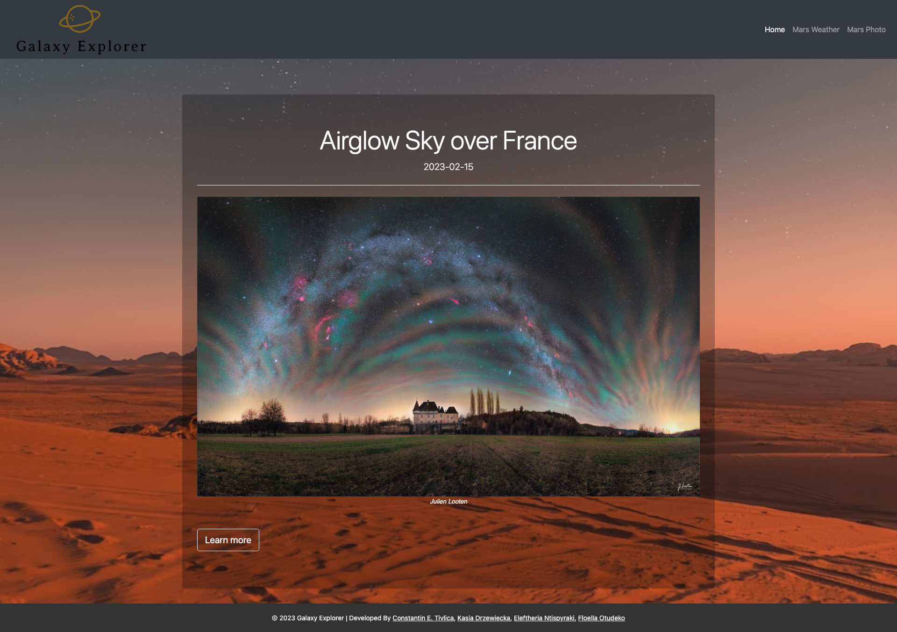
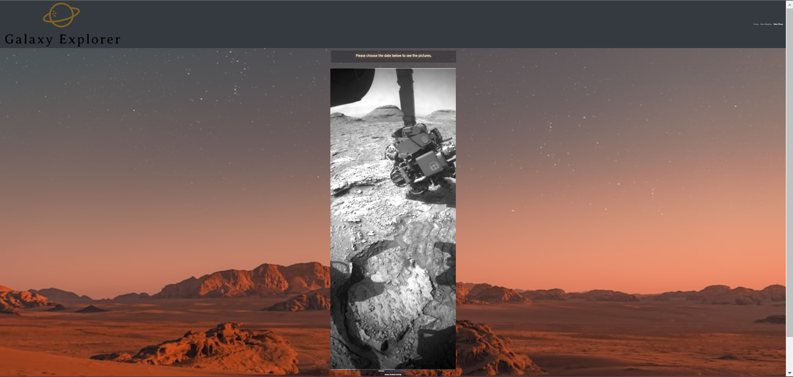

# Galaxy-Explorer

Galaxy Explorer is a comprehensive space exploration app that provides users with the latest NASA data and information about the galaxy. With its user-friendly interface, this app allows users to explore the vast reaches of our galaxy.The app retrieves data and images from the NASA APIs and provides access to a wide range of information related to space exploration and research. It provides users with an engaging and educational experience that highlights the incredible work being done by NASA and inspires a sense of wonder and curiosity about the Universe.

## Deployed Website

Checkout the live demo [@GalaxyExplorer](https://constantin-e-t.github.io/Galaxy-Explorer/) and start your journey to the Universe!

## Contents

* [Description](#description)
* [Screenshots](#screenshots)
* [Authors](#authors)
* [Skills](#skills)
* [License](#license)

## Description

* Our dynamic web-based application includes three main pages that showcase different aspects of space exploration and research.
* The first web-page (Home) presents the Astronomy Picture of the Day (APOD) Viewer, which displays a different stunning image of the cosmos every day along with its description.
* The second web-page (Mars Weather) presents the Mars Weather Service Viewer, which displays the Mars weather data that are available from NASA. 
* The third web-page (Mars Photo) presents a carousel that displays images captured by the Curiosity Rover. 
* The application is responsive and its user-friendly interface allows easy navigation and usage.

## Screenshots

## Usage

* Home page-the Astronomy Picture of the Day (APOD): Users can click on the "Learn more" button to access a detailed description of the image, which includes information on the subject of the photograph and its significance.
* Mars Weather page: Users can view temperature, pressure, and wind speed data. They can also access a random fact generator that provides interesting information about the red planet by clicking on the button.
* Mars Photo page: By choosing a specific date, users can browse through a selection of high-quality images and learn more about the rover's mission and discoveries.

## Skills

* Html
* CSS
* Javascript
* jQuery
* Bootstrap

## Authors

This is a team project, developed by Constantine E. Tivlica, Kasia Drzewiecka, Eleftheria Ntispyraki and Floella Otudeko.

* [Constantin-Emilian Tivlica](https://github.com/Constantin-E-T/)
* [Drzazga88](https://github.com/Drzazga88)
* [EleNtis](https://github.com/EleNtis)
* [ellaflo](https://github.com/ellaflo)

## License

Please refer to the LICENSE in the repo.
